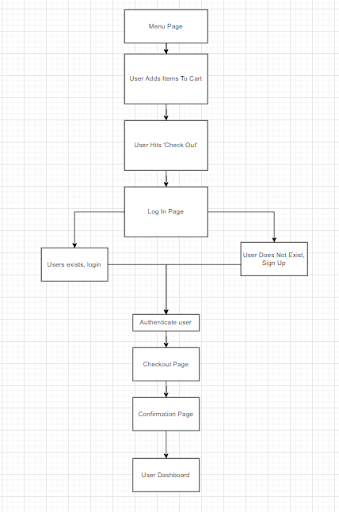

# Online Ordering System

## License
  
  
  ## Table of Contents
  - [Description](#description)
  - [Diagrams](#diagrams)
  - [Installation](#installation)
  - [Contributing](#contributing)
  - [Authors](#authors)
  - [Deployment](#deployment)

  ## Description

  Ordering food over the phone can be complicated when there isn’t a diagram or list of foods that the customer and restaurant can look at the same time. Plus with today’s language barriers, taking an order over the phone can be difficult especially in a loud restaurant. Our idea was to create an application that lets people order food from a restaurant and get it delivered with ease. A user can login to an account to see their previous orders to re-order, or make a completely new order. With simple to read menus and a streamlined way to choose multiple items, this method makes ordering/delivering food much easier than the old way of using a phone.

  1. Motivation for development:
  To make the interfacing of a customer and a restaurant easier and more streamlined by developing a website where they only need to spend a couple minutes on a webpage to create the order they want.

  1. User story:

    ` When I visit Pizza Palace website, I want to be able to login into the website with a username and password that will remember my past orders. `
    `Then I am able to create a food order with multiple items of each food. `
    `Then I want a list of those items to be placed into a cart where I can see the total of my order.`

  ## Diagrams
  Here is the diagram of our database

  Here is the diagram of the front end

  
## Installation
- Clone the repo
- Open a terminal & run `npm install` to install node modules
- Run `mysql -u root -p` 
- Enter your MySQL password
- run `source db/schema.sql;` to create the schema from MySQL shell
- run `exit` to quit the DBMS
- run `npm run seed` to seed the database from command line
- run `npm start` to start server
  
## Contributing
  We welcome all developers that are interested in this project to add more fancy features to the app! Feel free to contact us.

## Authors

  - [Ansab Sidiki](https://github.com/asidiki)
  - [Chen Wang](https://github.com/wangheer2010)
  - [Aireeal Blackmon](https://github.com/ablackmon1107)
  - [Cameron Harwood](https://github.com/harwcam)
  - [Mitchell Driesenga](https://github.com/mitchdriesenga)

## Deployment
  - Here is the screenshot of the app

  

  - [Link to the application]()

