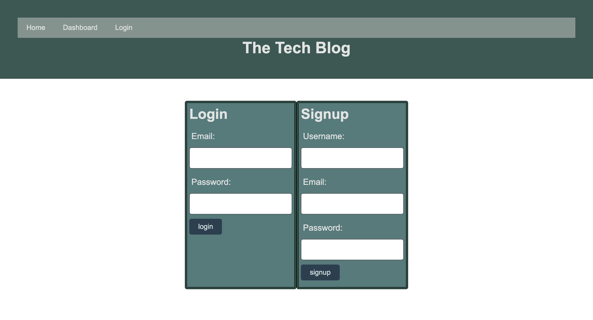

# Online Ordering System

## License
  
  
  ## Table of Contents
  - [Description](#description)
  - [Installation](#installation)
  - [Contributing](#contributing)
  - [Authors](#authors)
  - [Deployment](#deployment)

  ## Description
  This is a tech blog app, enabling people to post posts, view/edit/delete posts, and add comments.
  It requires logged in before doing the things mentioned above.
  - Here are several screenshots of the app
  1. This is the login page
  
  1. This is the dashboard page after login, when you don't have any post
  

  1. This is the how we add new post
  
  1. This is how our new post looks like after we click on confirm
  
  1. This is how our home page looks like after we posted the post
  
  
## Installation
Just go to our deployment link and you will be ready to start
  
## Contributing
  We welcome all developers that are interested in this project to add more fancy features to the app! Feel free to contact us.

## Authors
  - [Chen Wang](https://github.com/wangheer2010)

## Deployment

  - [Link to the application](https://chen-tech-blog-app.herokuapp.com/)

